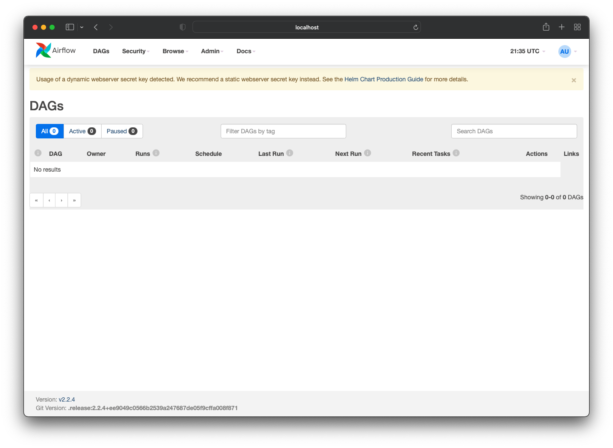
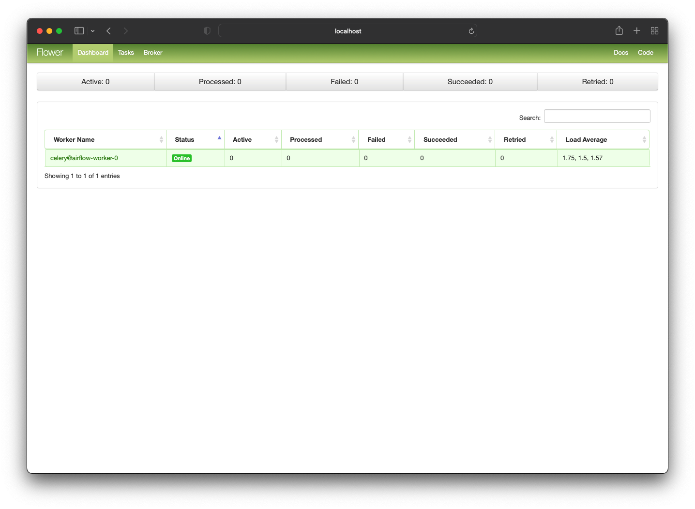
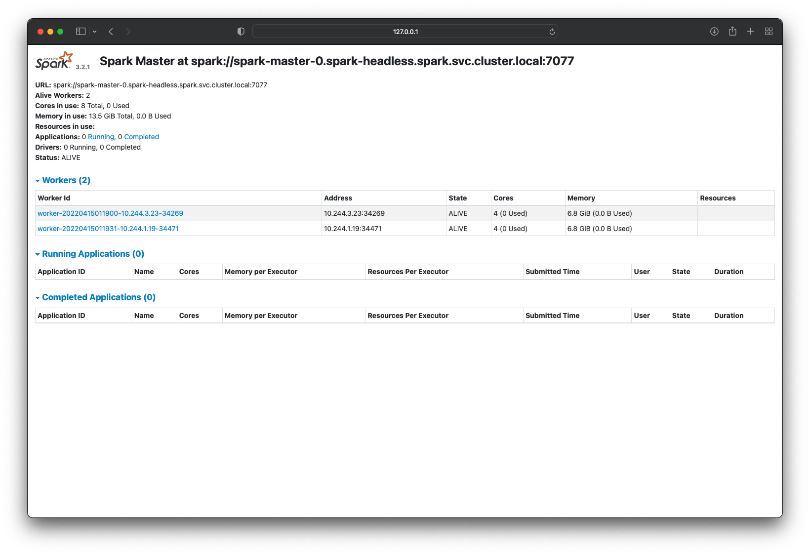

# how-to-helm
## Install helm
```
brew install helm
```

## Helm Chart for Apache Airflow
### Installing the Chart
```
helm repo add apache-airflow https://airflow.apache.org
helm upgrade --install airflow apache-airflow/airflow --namespace airflow --create-namespace
```

```
how-to-helm on  main
❯ helm repo add apache-airflow https://airflow.apache.org
"apache-airflow" has been added to your repositories
```
```
how-to-helm on  main [!]
❯ helm upgrade --install airflow apache-airflow/airflow --namespace airflow --create-namespace
Release "airflow" does not exist. Installing it now.
NAME: airflow
LAST DEPLOYED: Thu Apr 14 17:22:53 2022
NAMESPACE: airflow
STATUS: deployed
REVISION: 1
TEST SUITE: None
NOTES:
Thank you for installing Apache Airflow 2.2.4!

Your release is named airflow.
You can now access your dashboard(s) by executing the following command(s) and visiting the corresponding port at localhost in your browser:

Airflow Webserver:     kubectl port-forward svc/airflow-webserver 8080:8080 --namespace airflow
Flower dashboard:      kubectl port-forward svc/airflow-flower 5555:5555 --namespace airflow
Default Webserver (Airflow UI) Login credentials:
    username: admin
    password: admin
Default Postgres connection credentials:
    username: postgres
    password: postgres
    port: 5432

You can get Fernet Key value by running the following:

    echo Fernet Key: $(kubectl get secret --namespace airflow airflow-fernet-key -o jsonpath="{.data.fernet-key}" | base64 --decode)

###########################################################
#  WARNING: You should set a static webserver secret key  #
###########################################################

You are using a dynamically generated webserver secret key, which can lead to
unnecessary restarts of your Airflow components.

Information on how to set a static webserver secret key can be found here:
https://airflow.apache.org/docs/helm-chart/stable/production-guide.html#webserver-secret-key

```
```
how-to-helm on  main [!]
❯ k get po --namespace airflow
NAME                                 READY   STATUS    RESTARTS      AGE
airflow-flower-686dff4f59-5f6hj      1/1     Running   1 (5m ago)    6m46s
airflow-postgresql-0                 1/1     Running   0             6m46s
airflow-redis-0                      1/1     Running   0             6m46s
airflow-scheduler-d4f656459-hkbgm    2/2     Running   0             6m46s
airflow-statsd-75f567fd86-jsx2d      1/1     Running   0             6m46s
airflow-triggerer-64589b4954-zmz4m   1/1     Running   0             6m46s
airflow-webserver-75856ff5db-4lt5x   0/1     Running   1 (84s ago)   6m46s
airflow-worker-0                     2/2     Running   0             6m46s

```
```
how-to-helm on  main [!]
❯ k exec -n airflow -it airflow-scheduler-d4f656459-hkbgm -- /bin/bash
Defaulted container "scheduler" out of: scheduler, scheduler-log-groomer, wait-for-airflow-migrations (init)
airflow@airflow-scheduler-d4f656459-hkbgm:/opt/airflow$ pwd
/opt/airflow
airflow@airflow-scheduler-d4f656459-hkbgm:/opt/airflow$ ls -al
total 40
drwxrwxr-x 1 airflow root 4096 Apr 14 21:27 .
drwxr-xr-x 1 root    root 4096 Feb 22 20:12 ..
-rw-r--r-- 1 root    root 1180 Apr 14 21:23 airflow.cfg
drwxr-xr-x 2 root    root 4096 Apr 14 21:26 config
drwxrwxr-x 2 airflow root 4096 Feb 22 20:12 dags
drwxrwsrwx 4 root    root 4096 Apr 14 21:28 logs
drwxr-xr-x 3 root    root 4096 Apr 14 21:26 pod_templates
-rw-rw-r-- 1 airflow root 4695 Apr 14 21:27 webserver_config.py
airflow@airflow-scheduler-d4f656459-hkbgm:/opt/airflow$
```

port-forwarding
```
kubectl port-forward svc/airflow-webserver 8080:8080 --namespace airflow
kubectl port-forward svc/airflow-flower 5555:5555 --namespace airflow
```

```
localhost:8080 -> Airflow Webserver GUI
localhost:5555 -> Airflow Flower GUI
```



### Upgrading the Chart
```
helm upgrade airflow apache-airflow/airflow --namespace airflow
```

### Uninstalling the Chart
```
helm delete airflow --namespace airflow
```
## Helm Chart for Apache Spark (Bitnami)

### Adding bitnami helm repo
```
helm repo add bitnami https://charts.bitnami.com/bitnami
```

```
❯ helm repo add bitnami https://charts.bitnami.com/bitnami
"bitnami" has been added to your repositories
```

### Installing the Chart
```
helm install my-release bitnami/spark

or

helm upgrade --install spark  bitnami/spark --namespace spark --create-namespace
```


```
❯ helm upgrade --install spark  bitnami/spark --namespace spark --create-namespace
Release "spark" does not exist. Installing it now.
NAME: spark
LAST DEPLOYED: Thu Apr 14 21:11:56 2022
NAMESPACE: spark
STATUS: deployed
REVISION: 1
TEST SUITE: None
NOTES:
CHART NAME: spark
CHART VERSION: 5.9.9
APP VERSION: 3.2.1

** Please be patient while the chart is being deployed **

1. Get the Spark master WebUI URL by running these commands:

  kubectl port-forward --namespace spark svc/spark-master-svc 80:80
  echo "Visit http://127.0.0.1:80 to use your application"

2. Submit an application to the cluster:

  To submit an application to the cluster the spark-submit script must be used. That script can be
  obtained at https://github.com/apache/spark/tree/master/bin. Also you can use kubectl run.

  export EXAMPLE_JAR=$(kubectl exec -ti --namespace spark spark-worker-0 -- find examples/jars/ -name 'spark-example*\.jar' | tr -d '\r')

  kubectl exec -ti --namespace spark spark-worker-0 -- spark-submit --master spark://spark-master-svc:7077 \
    --class org.apache.spark.examples.SparkPi \
    $EXAMPLE_JAR 5

** IMPORTANT: When submit an application from outside the cluster service type should be set to the NodePort or LoadBalancer. **

** IMPORTANT: When submit an application the --master parameter should be set to the service IP, if not, the application will not resolve the master. **

```
### Port forwarding

```
kubectl port-forward --namespace spark svc/spark-master-svc 80:80

❯ kubectl port-forward --namespace spark svc/spark-master-svc 80:80
Unable to listen on port 80: Listeners failed to create with the following errors: [unable to create listener: Error listen tcp4 127.0.0.1:80: bind: permission denied unable to create listener: Error listen tcp6 [::1]:80: bind: permission denied]
error: unable to listen on any of the requested ports: [{80 8080}]

# use sudo
❯ sudo kubectl port-forward --namespace spark svc/spark-master-svc 80:80
Password:
Forwarding from 127.0.0.1:80 -> 8080
Forwarding from [::1]:80 -> 8080

```


```
❯ k get po -n spark
NAME             READY   STATUS    RESTARTS      AGE
spark-master-0   1/1     Running   0             8m20s
spark-worker-0   1/1     Running   1 (90s ago)   8m20s
spark-worker-1   1/1     Running   0             58s
```
```
http://127.0.0.1:80
```

