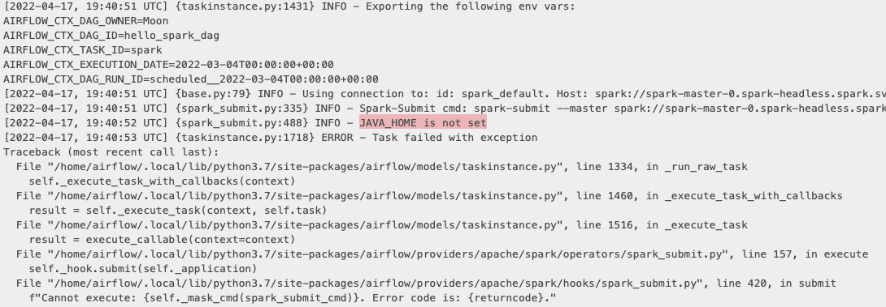
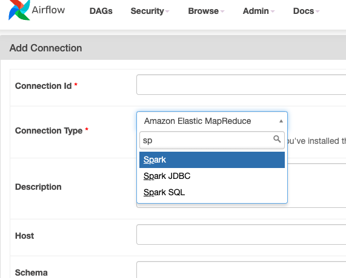

# Custom image for Apache Airflow
Since the base image from `Apache Airflow Helm Chart 1.5.0` does not include the  `apache-airflow-providers-apache-spark` package by default, going to build a new image for spark DAG writing practices.

## Dockerfile
```
FROM apache/airflow:2.2.4

RUN pip install apache-airflow-providers-apache-spark

USER root

RUN apt-get update \
  && apt-get install -y openjdk-11-jdk \
  && apt-get install -y ant \
  && apt-get install -y vim \
  && apt-get install -y --no-install-recommends \
  && apt-get autoremove -yqq --purge \
  && apt-get clean \
  && rm -rf /var/lib/apt/lists/*

# Set JAVA_HOME; need Java to run Spark. Make sure this version matches the one on Spark
# Currently, we're using Spark:3.1.2 which depends on the JDK build 1.8.0
ENV JAVA_HOME /usr/lib/jvm/java-11-openjdk-amd64/
RUN export JAVA_HOME

USER airflow


```
### What happens if your aiflow doesn't have java - DAG Failure



### Docker pull
```
docker pull apache/airflow:2.2.4
2.2.4: Pulling from apache/airflow
6552179c3509: Pull complete
c4887dad22fd: Pull complete
83fecc69c367: Pull complete
a9d24969a226: Pull complete
af77bcde342c: Pull complete
00863cfd5a9e: Pull complete
c40be9e1e4bf: Pull complete
a08535d2daf5: Pull complete
693eef757df9: Pull complete
e8baf1dbb35f: Pull complete
eb51531616b8: Pull complete
5bbbc0997947: Pull complete
c9349d12f3ef: Pull complete
a3ed95caeb02: Pull complete
Digest: sha256:72a2cdcdabbc622c30940f1a9f262d047fdbbe96d5d7a4e324b8c7ec5ef56171
Status: Downloaded newer image for apache/airflow:2.2.4
docker.io/apache/airflow:2.2.4
```
### Docker build
```
# docker build -t myImageName:TagName dir
docker build -t bmoon0702/airflow:2.2.4-openjdk-11 .
[+] Building 556.2s (8/8) FINISHED
...
...
```
```
❯ docker images
REPOSITORY          TAG                    IMAGE ID       CREATED          SIZE
bmoon0702/airflow   2.2.4-openjdk-11       5db37cbcd962   8 seconds ago    2.61GB
kindest/node        <none>                 f9d67d6e8342   6 weeks ago      1.21GB
apache/airflow      2.2.4                  88fe05822640   7 weeks ago      1.07GB
```
### Docker push to your docker.io repo
```
❯ docker push bmoon0702/airflow:2.2.4-openjdk-11
The push refers to repository [docker.io/bmoon0702/airflow]
d3a68e677f4c: Pushed
5f70bf18a086: Mounted from apache/airflow
98ec9ef0a571: Mounted from apache/airflow
0aa8958ab0d3: Mounted from apache/airflow
f219fa6fb690: Mounted from apache/airflow
ec35a78b3acf: Mounted from apache/airflow
9d6d109d9533: Mounted from apache/airflow
8c71c0b029ba: Mounted from apache/airflow
25b0f678602e: Mounted from apache/airflow
5d6562ea07fb: Mounted from apache/airflow
6722e74c53d1: Mounted from apache/airflow
0e1f1c8f01cf: Mounted from apache/airflow
65a900eeb209: Mounted from apache/airflow
8cc37281088b: Mounted from apache/airflow
f18b02b14138: Mounted from apache/airflow
2.2.4: digest: sha256:b91591263c9d91d90f14b5b08a5cd132f42cf5a1256dc83817fb6baad09d3dd4 size: 3465
```

## Update values.yaml
```
...
# Images
images:
  airflow:
    repository: bmoon0702/airflow
    tag: 2.2.4-openjdk-11
    pullPolicy: IfNotPresent
...
```
## Spin up your airflow with your new docker image
```
helm upgrade --install airflow apache-airflow/airflow --values=values.yaml --namespace airflow --create-namespace

```


## Note

Make sure JAVA_HOME is there
```
❯ k -n airflow exec -it airflow-scheduler-6b7b644c94-ggvtx -- /bin/bash
Defaulted container "scheduler" out of: scheduler, scheduler-log-groomer, wait-for-airflow-migrations (init)
airflow@airflow-scheduler-6b7b644c94-ggvtx:/opt/airflow$ echo $JAVA_HOME
/usr/lib/jvm/java-11-openjdk-amd64/
```
and Spark packages
```

```