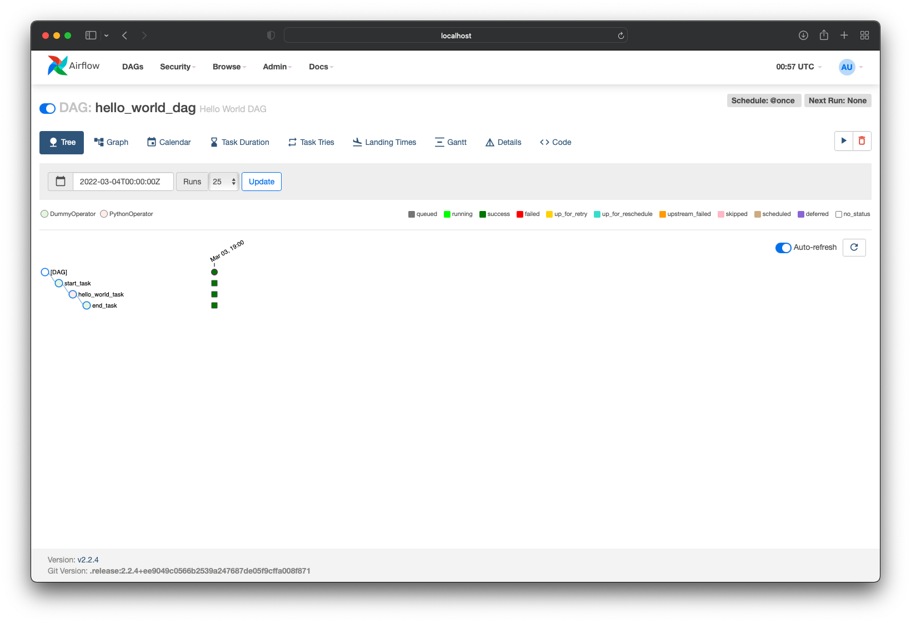

### How to cp dags into dag folder
```
❯ k get po -n airflow
NAME                                 READY   STATUS    RESTARTS       AGE
airflow-flower-686dff4f59-kbctq      1/1     Running   6 (6m2s ago)   11m
airflow-postgresql-0                 1/1     Running   0              11m
airflow-redis-0                      1/1     Running   0              11m
airflow-scheduler-d4f656459-jzg86    2/2     Running   0              11m
airflow-statsd-75f567fd86-zmdc5      1/1     Running   0              11m
airflow-triggerer-64589b4954-wg6zf   1/1     Running   0              11m
airflow-webserver-575995f-8hcdj      1/1     Running   0              11m
airflow-worker-0                     2/2     Running   0              11m
```

```
# copy dags into both airflow scheduler and worker

❯ k -n airflow cp airflow/dags/test.py airflow-scheduler-d4f656459-jzg86:/opt/airflow/dags/test.py
Defaulted container "scheduler" out of: scheduler, scheduler-log-groomer, wait-for-airflow-migrations (init)

❯ k -n airflow cp airflow/dags/test.py airflow-worker-0:/opt/airflow/dags/test.py
Defaulted container "worker" out of: worker, worker-log-groomer, wait-for-airflow-migrations (init)
```
```
❯ k exec -n airflow -it airflow-scheduler-d4f656459-jzg86 -- /bin/bash
Defaulted container "scheduler" out of: scheduler, scheduler-log-groomer, wait-for-airflow-migrations (init)
airflow@airflow-scheduler-d4f656459-hkbgm:/opt/airflow$ cd dags
airflow@airflow-scheduler-d4f656459-hkbgm:/opt/airflow/dags$ ls
test.py

```

