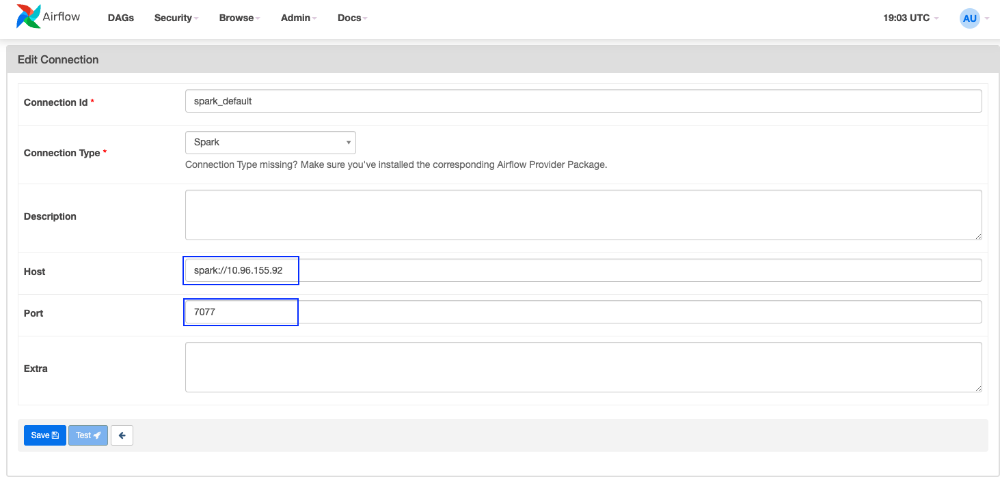
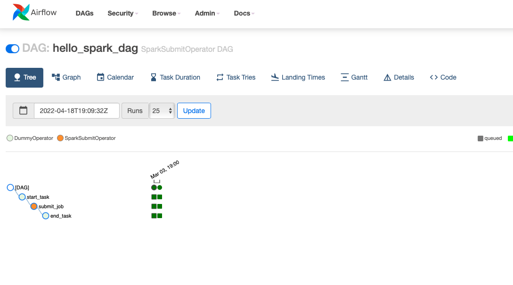
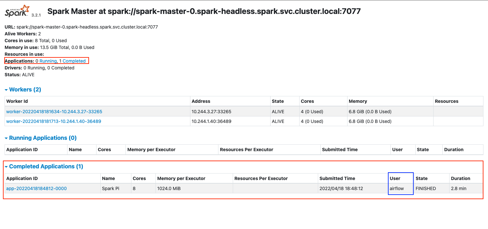

### How to cp dags into dag folder
```
❯ k get po -n airflow
NAME                                 READY   STATUS    RESTARTS       AGE
airflow-flower-686dff4f59-kbctq      1/1     Running   6 (6m2s ago)   11m
airflow-postgresql-0                 1/1     Running   0              11m
airflow-redis-0                      1/1     Running   0              11m
airflow-scheduler-d4f656459-jzg86    2/2     Running   0              11m
airflow-statsd-75f567fd86-zmdc5      1/1     Running   0              11m
airflow-triggerer-64589b4954-wg6zf   1/1     Running   0              11m
airflow-webserver-575995f-8hcdj      1/1     Running   0              11m
airflow-worker-0                     2/2     Running   0              11m
```

```
# copy dags into both airflow scheduler and worker

❯ k -n airflow cp airflow/dags/test.py airflow-scheduler-d4f656459-jzg86:/opt/airflow/dags/test.py
Defaulted container "scheduler" out of: scheduler, scheduler-log-groomer, wait-for-airflow-migrations (init)

❯ k -n airflow cp airflow/dags/test.py airflow-worker-0:/opt/airflow/dags/test.py
Defaulted container "worker" out of: worker, worker-log-groomer, wait-for-airflow-migrations (init)
```
```
❯ k exec -n airflow -it airflow-scheduler-d4f656459-jzg86 -- /bin/bash
Defaulted container "scheduler" out of: scheduler, scheduler-log-groomer, wait-for-airflow-migrations (init)
airflow@airflow-scheduler-d4f656459-hkbgm:/opt/airflow$ cd dags
airflow@airflow-scheduler-d4f656459-hkbgm:/opt/airflow/dags$ ls
test.py

```


## Submit Spark job
### spark_test.py
```
from datetime import datetime
from airflow.models import DAG
from airflow.operators.dummy_operator import DummyOperator
from airflow.providers.apache.spark.operators.spark_submit import SparkSubmitOperator

default_args = {
		'owner': 'Moon',
		'start_date': datetime(2022, 3, 4),
}

# Instantiate a DAG object
dag = DAG('hello_spark_dag',
		default_args=default_args,
		description='SparkSubmitOperator DAG',
		schedule_interval='@once',
		catchup=False,
		tags=['example, spark']
)

start_task = DummyOperator(
    task_id='start_task',
    dag=dag
    )

submit_job = SparkSubmitOperator(
    conn_id="spark_default",
    java_class="org.apache.spark.examples.SparkPi",
    application="/opt/airflow/jars/spark-examples_2.12-3.2.1.jar", # deploy-mode : client
    #application="/opt/bitnami/spark/examples/jars/spark-examples_2.12-3.2.1.jar", # deploy-mode : cluster -> does not work
    task_id="submit_job",
    application_args=["1"],
    verbose=True,
    name='SparkPi',
    dag=dag
)

end_task = DummyOperator(
    task_id='end_task',
    dag=dag
    )

start_task >> submit_job >> end_task

```

### spark-examples_2.12-3.2.1.jar
Make sure you cp this sample jar in both scheduler and worker pod
```
airflow@airflow-scheduler-5887d8959d-tvfjm:/opt/airflow$ ls /opt/airflow/dags/jars
spark-examples_2.12-3.2.1.jar
```

### setup spark connection
you need to get `spark-master-svc` 's IP (10.96.155.92 below)
```
❯ k get svc -n spark
NAME               TYPE        CLUSTER-IP     EXTERNAL-IP   PORT(S)           AGE
spark-headless     ClusterIP   None           <none>        <none>            49m
spark-master-svc   ClusterIP   10.96.155.92   <none>        7077/TCP,80/TCP   49m
```
```
host: spark://10.96.155.92
port: 7077
```


### run your dag

```
[2022-04-18, 19:09:38 UTC] {taskinstance.py:1431} INFO - Exporting the following env vars:
AIRFLOW_CTX_DAG_OWNER=Moon
AIRFLOW_CTX_DAG_ID=hello_spark_dag
AIRFLOW_CTX_TASK_ID=submit_job
AIRFLOW_CTX_EXECUTION_DATE=2022-04-18T19:09:32.509388+00:00
AIRFLOW_CTX_DAG_RUN_ID=manual__2022-04-18T19:09:32.509388+00:00
..
[2022-04-18, 19:12:34 UTC] {spark_submit.py:488} INFO - Pi is roughly 3.142758285516571
...
...
[2022-04-18, 19:13:44 UTC] {spark_submit.py:488} INFO - 22/04/18 19:13:44 INFO SparkContext: Successfully stopped SparkContext
...
[2022-04-18, 19:13:45 UTC] {taskinstance.py:1282} INFO - Marking task as SUCCESS. dag_id=hello_spark_dag, task_id=submit_job, execution_date=20220418T190932, start_date=20220418T190937, end_date=20220418T191345
```


### Note
This is running in `--deploy-mode client` not `--deploy-mode cluster`

```
--deploy-mode: Whether to deploy your driver on the worker nodes (cluster) or locally as an external client (client) (default: client)
```

BTW, what is driver in Spark world??
```
driver is the process running the main() function of the application and creating the SparkContext
```

Note that in client mode -> `only the driver runs locally (i.e, Airflow)` and `all actual tasks run on Spark cluster worker nodes (spark executors)`.


More read : https://blog.knoldus.com/cluster-vs-client-execution-modes-for-a-spark-application/
