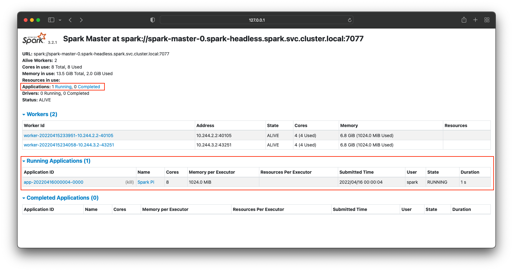
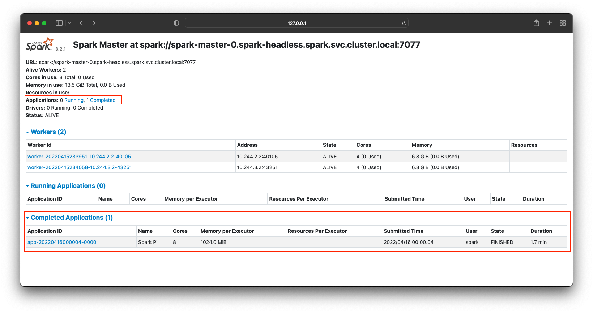

# Build a custom docker image
## Dockerfile
```
FROM bitnami/spark:3.2.1

USER root

RUN apt-get update \
  && apt-get install -y openjdk-11-jdk \
  && apt-get install -y ant \
  && apt-get install -y vim \
  && apt-get install -y --no-install-recommends \
  && apt-get autoremove -yqq --purge \
  && apt-get clean \
  && rm -rf /var/lib/apt/lists/*

# Set JAVA_HOME; need Java to run Spark. Make sure this version matches the one on Airflow
ENV JAVA_HOME /usr/lib/jvm/java-11-openjdk-amd64
ENV PATH=/opt/bitnami/python/bin:/usr/lib/jvm/java-11-openjdk-amd64:/opt/bitnami/spark/bin:/opt/bitnami/spark/sbin:/opt/bitnami/common/bin:/usr/local/sbin:/usr/local/bin:/usr/sbin:/usr/bin:/sbin:/bin

RUN export JAVA_HOME && \
    echo 'JAVA_HOME=/usr/lib/jvm/java-11-openjdk-amd64' >> /etc/environment && \
    echo 'JAVA_HOME=/usr/lib/jvm/java-11-openjdk-amd64' >> /opt/bitnami/spark/conf/spark-env.sh

RUN chown 1001 -R /etc/environment && \
    chown 1001 -R /opt/bitnami/spark/conf/spark-env.sh

```
## Docker build
```
docker build -t bmoon0702/spark-custom:3.2.1 .
[+] Building 95.9s (8/8)
...
...
=> => naming to docker.io/bmoon0702/spark-custom:3.2.1
```

## Docker push
```
❯ docker push bmoon0702/spark-custom:3.2.1
The push refers to repository [docker.io/bmoon0702/spark-custom]
780c8eace3b8: Pushed
da256b840298: Pushed
db73c9051a0c: Mounted from bitnami/spark
5bc32f099385: Mounted from bitnami/spark
...

```

# Spin up spark with a custom image
```
helm upgrade --install spark  bitnami/spark  --values=values.yaml --namespace spark --create-namespace
```

# Submit an application to the Spark cluster

## Hint
```
❯ helm upgrade --install spark  bitnami/spark --namespace spark --create-namespace
Release "spark" does not exist. Installing it now.
NAME: spark
LAST DEPLOYED: Thu Apr 14 21:11:56 2022
NAMESPACE: spark
STATUS: deployed
REVISION: 1
TEST SUITE: None
NOTES:
CHART NAME: spark
CHART VERSION: 5.9.9
APP VERSION: 3.2.1

** Please be patient while the chart is being deployed **

1. Get the Spark master WebUI URL by running these commands:

  kubectl port-forward --namespace spark svc/spark-master-svc 80:80
  echo "Visit http://127.0.0.1:80 to use your application"

2. Submit an application to the cluster: *** Important here!!!****

  To submit an application to the cluster the spark-submit script must be used. That script can be
  obtained at https://github.com/apache/spark/tree/master/bin. Also you can use kubectl run.

  export EXAMPLE_JAR=$(kubectl exec -ti --namespace spark spark-worker-0 -- find examples/jars/ -name 'spark-example*\.jar' | tr -d '\r')

  kubectl exec -ti --namespace spark spark-worker-0 -- spark-submit --master spark://spark-master-svc:7077 \
    --class org.apache.spark.examples.SparkPi \
    $EXAMPLE_JAR 5

** IMPORTANT: When submit an application from outside the cluster service type should be set to the NodePort or LoadBalancer. **

** IMPORTANT: When submit an application the --master parameter should be set to the service IP, if not, the application will not resolve the master. **

```

## spark-submit.sh - $SPARK_HOME/bin/spark-sunmit.sh
```
#!/usr/bin/env bash

# Ref = https://github.com/apache/spark/blob/master/bin/spark-submit

if [ -z "${SPARK_HOME}" ]; then
  source "$(dirname "$0")"/find-spark-home
fi

# disable randomized hash for string in Python 3.3+
export PYTHONHASHSEED=0

exec "${SPARK_HOME}"/bin/spark-class org.apache.spark.deploy.SparkSubmit "$@"

```
`./bin/spark-submit --help`

```
I have no name!@spark-master-0:/opt/bitnami/spark$ ./bin/spark-submit --help
Usage: spark-submit [options] <app jar | python file | R file> [app arguments]
Usage: spark-submit --kill [submission ID] --master [spark://...]
Usage: spark-submit --status [submission ID] --master [spark://...]
Usage: spark-submit run-example [options] example-class [example args]

Options:
  --master MASTER_URL         spark://host:port, mesos://host:port, yarn,
                              k8s://https://host:port, or local (Default: local[*]).
  --deploy-mode DEPLOY_MODE   Whether to launch the driver program locally ("client") or
                              on one of the worker machines inside the cluster ("cluster")
                              (Default: client).
  --class CLASS_NAME          Your application's main class (for Java / Scala apps).
  --name NAME                 A name of your application.
  --jars JARS                 Comma-separated list of jars to include on the driver
                              and executor classpaths.
  --packages                  Comma-separated list of maven coordinates of jars to include
                              on the driver and executor classpaths. Will search the local
                              maven repo, then maven central and any additional remote
                              repositories given by --repositories. The format for the
                              coordinates should be groupId:artifactId:version.
  --exclude-packages          Comma-separated list of groupId:artifactId, to exclude while
                              resolving the dependencies provided in --packages to avoid
                              dependency conflicts.
  --repositories              Comma-separated list of additional remote repositories to
                              search for the maven coordinates given with --packages.
  --py-files PY_FILES         Comma-separated list of .zip, .egg, or .py files to place
                              on the PYTHONPATH for Python apps.
  --files FILES               Comma-separated list of files to be placed in the working
                              directory of each executor. File paths of these files
                              in executors can be accessed via SparkFiles.get(fileName).
  --archives ARCHIVES         Comma-separated list of archives to be extracted into the
                              working directory of each executor.

  --conf, -c PROP=VALUE       Arbitrary Spark configuration property.
  --properties-file FILE      Path to a file from which to load extra properties. If not
                              specified, this will look for conf/spark-defaults.conf.

  --driver-memory MEM         Memory for driver (e.g. 1000M, 2G) (Default: 1024M).
  --driver-java-options       Extra Java options to pass to the driver.
  --driver-library-path       Extra library path entries to pass to the driver.
  --driver-class-path         Extra class path entries to pass to the driver. Note that
                              jars added with --jars are automatically included in the
                              classpath.

  --executor-memory MEM       Memory per executor (e.g. 1000M, 2G) (Default: 1G).

  --proxy-user NAME           User to impersonate when submitting the application.
                              This argument does not work with --principal / --keytab.

  --help, -h                  Show this help message and exit.
  --verbose, -v               Print additional debug output.
  --version,                  Print the version of current Spark.

 Cluster deploy mode only:
  --driver-cores NUM          Number of cores used by the driver, only in cluster mode
                              (Default: 1).

 Spark standalone or Mesos with cluster deploy mode only:
  --supervise                 If given, restarts the driver on failure.

 Spark standalone, Mesos or K8s with cluster deploy mode only:
  --kill SUBMISSION_ID        If given, kills the driver specified.
  --status SUBMISSION_ID      If given, requests the status of the driver specified.

 Spark standalone, Mesos and Kubernetes only:
  --total-executor-cores NUM  Total cores for all executors.

 Spark standalone, YARN and Kubernetes only:
  --executor-cores NUM        Number of cores used by each executor. (Default: 1 in
                              YARN and K8S modes, or all available cores on the worker
                              in standalone mode).

 Spark on YARN and Kubernetes only:
  --num-executors NUM         Number of executors to launch (Default: 2).
                              If dynamic allocation is enabled, the initial number of
                              executors will be at least NUM.
  --principal PRINCIPAL       Principal to be used to login to KDC.
  --keytab KEYTAB             The full path to the file that contains the keytab for the
                              principal specified above.

 Spark on YARN only:
  --queue QUEUE_NAME          The YARN queue to submit to (Default: "default").

```
## Sample with spark-subnmit binary inside a container ($SPARK_HOME/examples/jars/spark-examples_2.12-3.2.1.jar)
```
I have no name!@spark-master-0:/opt/bitnami/spark$ ./bin/spark-submit \
    --class org.apache.spark.examples.SparkPi \
    $SPARK_HOME/examples/jars/spark-examples_2.12-3.2.1.jar 5

Using Spark's default log4j profile: org/apache/spark/log4j-defaults.properties
22/04/15 23:55:37 INFO SparkContext: Running Spark version 3.2.1
22/04/15 23:55:38 WARN NativeCodeLoader: Unable to load native-hadoop library for your platform... using builtin-java classes where applicable
22/04/15 23:55:38 INFO ResourceUtils: ==============================================================
22/04/15 23:55:38 INFO ResourceUtils: No custom resources configured for spark.driver.
22/04/15 23:55:38 INFO ResourceUtils: ==============================================================
22/04/15 23:55:38 INFO SparkContext: Submitted application: Spark Pi
22/04/15 23:55:39 INFO ResourceProfile: Default ResourceProfile created, executor resources: Map(cores -> name: cores, amount: 1, script: , vendor: , memory -> name: memory, amount: 1024, script: , vendor: , offHeap -> name: offHeap, amount: 0, script: , vendor: ), task resources: Map(cpus -> name: cpus, amount: 1.0)
22/04/15 23:55:39 INFO ResourceProfile: Limiting resource is cpu
22/04/15 23:55:39 INFO ResourceProfileManager: Added ResourceProfile id: 0
22/04/15 23:55:39 INFO SecurityManager: Changing view acls to: spark
22/04/15 23:55:39 INFO SecurityManager: Changing modify acls to: spark
22/04/15 23:55:39 INFO SecurityManager: Changing view acls groups to:
22/04/15 23:55:39 INFO SecurityManager: Changing modify acls groups to:
22/04/15 23:55:39 INFO SecurityManager: SecurityManager: authentication disabled; ui acls disabled; users  with view permissions: Set(spark); groups with view permissions: Set(); users  with modify permissions: Set(spark); groups with modify permissions: Set()
...
...
22/04/15 23:55:59 INFO DAGScheduler: Job 0 finished: reduce at SparkPi.scala:38, took 7.494728 s
Pi is roughly 3.1419102838205677
...

```
## Sample with spark-submit + kubectl
```
export EXAMPLE_JAR=$(kubectl exec -ti --namespace spark spark-worker-0 -- find examples/jars/ -name 'spark-example*\.jar' | tr -d '\r')

```
```
❯ kubectl exec -ti --namespace spark spark-worker-0 -- spark-submit --master spark://spark-master-svc:7077 \
    --class org.apache.spark.examples.SparkPi \
    $EXAMPLE_JAR 5
Using Spark's default log4j profile: org/apache/spark/log4j-defaults.properties
22/04/15 01:32:36 INFO SparkContext: Running Spark version 3.2.1
22/04/15 01:32:36 WARN NativeCodeLoader: Unable to load native-hadoop library for your platform... using builtin-java classes where applicable
22/04/15 01:32:37 INFO ResourceUtils: ==============================================================
22/04/15 01:32:37 INFO ResourceUtils: No custom resources configured for spark.driver.
22/04/15 01:32:37 INFO ResourceUtils: ==============================================================
22/04/15 01:32:37 INFO SparkContext: Submitted application: Spark Pi
22/04/15 01:32:37 INFO ResourceProfile: Default ResourceProfile created, executor resources: Map(cores -> name: cores, amount: 1, script: , vendor: , memory -> name: memory, amount: 1024, script: , vendor: , offHeap -> name: offHeap, amount: 0, script: , vendor: ), task resources: Map(cpus -> name: cpus, amount: 1.0)
22/04/15 01:32:37 INFO ResourceProfile: Limiting resource is cpu
22/04/15 01:32:37 INFO ResourceProfileManager: Added ResourceProfile id: 0
...
...
22/04/15 01:33:27 INFO DAGScheduler: Job 0 finished: reduce at SparkPi.scala:38, took 33.758745 s
Pi is roughly 3.1455262910525823
...
...
22/04/15 01:34:28 INFO SparkContext: Successfully stopped SparkContext
22/04/15 01:34:29 INFO ShutdownHookManager: Shutdown hook called
22/04/15 01:34:29 INFO ShutdownHookManager: Deleting directory /tmp/spark-51d9a1f1-4ec7-44ef-99f3-453aaadb03bb
22/04/15 01:34:29 INFO ShutdownHookManager: Deleting directory /tmp/spark-35585a78-9b3c-4c54-808e-524f6b08eeee
```


