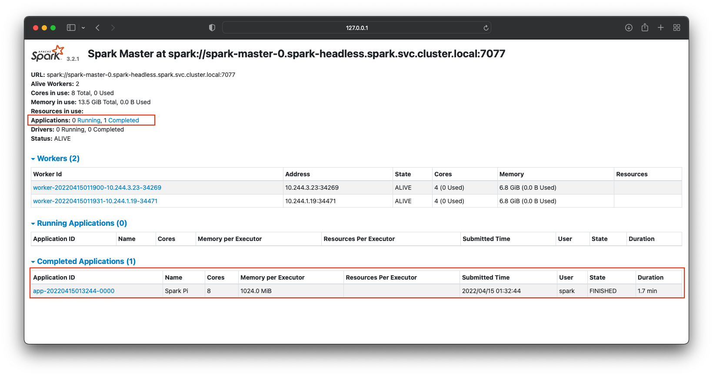

# Submit an application to the Spark cluster

## Hint
```
❯ helm upgrade --install spark  bitnami/spark --namespace spark --create-namespace
Release "spark" does not exist. Installing it now.
NAME: spark
LAST DEPLOYED: Thu Apr 14 21:11:56 2022
NAMESPACE: spark
STATUS: deployed
REVISION: 1
TEST SUITE: None
NOTES:
CHART NAME: spark
CHART VERSION: 5.9.9
APP VERSION: 3.2.1

** Please be patient while the chart is being deployed **

1. Get the Spark master WebUI URL by running these commands:

  kubectl port-forward --namespace spark svc/spark-master-svc 80:80
  echo "Visit http://127.0.0.1:80 to use your application"

2. Submit an application to the cluster: *** Important here!!!****

  To submit an application to the cluster the spark-submit script must be used. That script can be
  obtained at https://github.com/apache/spark/tree/master/bin. Also you can use kubectl run.

  export EXAMPLE_JAR=$(kubectl exec -ti --namespace spark spark-worker-0 -- find examples/jars/ -name 'spark-example*\.jar' | tr -d '\r')

  kubectl exec -ti --namespace spark spark-worker-0 -- spark-submit --master spark://spark-master-svc:7077 \
    --class org.apache.spark.examples.SparkPi \
    $EXAMPLE_JAR 5

** IMPORTANT: When submit an application from outside the cluster service type should be set to the NodePort or LoadBalancer. **

** IMPORTANT: When submit an application the --master parameter should be set to the service IP, if not, the application will not resolve the master. **

```

## spark-submit.sh
```
#!/usr/bin/env bash

# Ref = https://github.com/apache/spark/blob/master/bin/spark-submit

if [ -z "${SPARK_HOME}" ]; then
  source "$(dirname "$0")"/find-spark-home
fi

# disable randomized hash for string in Python 3.3+
export PYTHONHASHSEED=0

exec "${SPARK_HOME}"/bin/spark-class org.apache.spark.deploy.SparkSubmit "$@"

```

## Sample with kubectl
```
export EXAMPLE_JAR=$(kubectl exec -ti --namespace spark spark-worker-0 -- find examples/jars/ -name 'spark-example*\.jar' | tr -d '\r')

```
```
❯ kubectl exec -ti --namespace spark spark-worker-0 -- spark-submit --master spark://spark-master-svc:7077 \
    --class org.apache.spark.examples.SparkPi \
    $EXAMPLE_JAR 5
Using Spark's default log4j profile: org/apache/spark/log4j-defaults.properties
22/04/15 01:32:36 INFO SparkContext: Running Spark version 3.2.1
22/04/15 01:32:36 WARN NativeCodeLoader: Unable to load native-hadoop library for your platform... using builtin-java classes where applicable
22/04/15 01:32:37 INFO ResourceUtils: ==============================================================
22/04/15 01:32:37 INFO ResourceUtils: No custom resources configured for spark.driver.
22/04/15 01:32:37 INFO ResourceUtils: ==============================================================
22/04/15 01:32:37 INFO SparkContext: Submitted application: Spark Pi
22/04/15 01:32:37 INFO ResourceProfile: Default ResourceProfile created, executor resources: Map(cores -> name: cores, amount: 1, script: , vendor: , memory -> name: memory, amount: 1024, script: , vendor: , offHeap -> name: offHeap, amount: 0, script: , vendor: ), task resources: Map(cpus -> name: cpus, amount: 1.0)
22/04/15 01:32:37 INFO ResourceProfile: Limiting resource is cpu
22/04/15 01:32:37 INFO ResourceProfileManager: Added ResourceProfile id: 0
...
...
22/04/15 01:33:27 INFO DAGScheduler: Job 0 finished: reduce at SparkPi.scala:38, took 33.758745 s
Pi is roughly 3.1455262910525823
...
...
22/04/15 01:34:28 INFO SparkContext: Successfully stopped SparkContext
22/04/15 01:34:29 INFO ShutdownHookManager: Shutdown hook called
22/04/15 01:34:29 INFO ShutdownHookManager: Deleting directory /tmp/spark-51d9a1f1-4ec7-44ef-99f3-453aaadb03bb
22/04/15 01:34:29 INFO ShutdownHookManager: Deleting directory /tmp/spark-35585a78-9b3c-4c54-808e-524f6b08eeee
```

